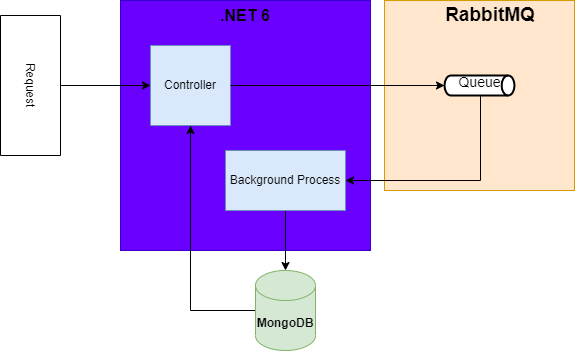
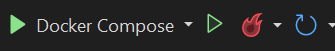

# Data Bridge

- [Data Bridge](#data-bridge)
- [Introduction](#introduction)
  - [Architecture](#architecture)
  - [Setup](#setup)
    - [Pre-Requisites](#pre-requisites)
    - [How to install](#how-to-install)
  - [Endpoints](#endpoints)

# Introduction
This project was built for educational purposes.  
Some inputs, such as connection string and credentials, are explicit just for this demo.  
In order to store Credential and Connection String MUST HAVE use "User Secrets" avaliable on .NET

## Architecture
  


## Setup
### Pre-Requisites
- .NET 6
- Docker Desktop
- Mongo Compass or any similar client
  
### How to install
*Using a console navigate to solution(DataBridge.sln) folder and type the command below or just copy/paste:*
```
docker-compose up
```

- Alternative: Open Solution in Visual Studio and click Run Docker Compose:
  

## Endpoints
## GET List of all Ids
`GET /sendmessage/`

    

### Response
```
 {
    "id": "62d810efe02e6c4e6f7bc8aa",
    "message": "teste do put",
    "dateTime": "2022-07-20T14:27:59.161Z"
 },
 {
    "id": "62d812c5097c33e97b0324aa",
    "message": "{\"MessageToSend\":\"teste de mensagem\"}",
    "dateTime": "2022-07-20T14:35:49.629Z"
 },
 {
    "id": "62d812c7097c33e97b0324ab",
    "message": "{\"MessageToSend\":\"teste de mensagem\"}",
    "dateTime": "2022-07-20T14:35:51.732Z"
 }
  ```

## GET by ID
`GET /sendmessage/{id}`

### Response
```
{
  "id": "62d812c5097c33e97b0324aa",
  "message": "{\"MessageToSend\":\"teste de mensagem\"}",
  "dateTime": "2022-07-20T14:35:49.629Z"
}
```

## POST 
`POST /sendmessage/`

### Request Body
```
{
  "messageToSend": "string"
}
```

### Response
```
Status 200
```

## PUT 
`PUT /sendmessage/`

### Request Body
```
{
  "id": "string",
  "message": "string",
  "dateTime": "2022-07-21T12:33:43.859Z"
}
```

### Response
```
Status 200
```

## DELETE 
`DELETE /sendmessage/{id}`


### Response
```
Status 200
```


## RabbitMQ UI Console
http://localhost:15672/


